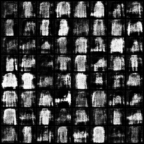
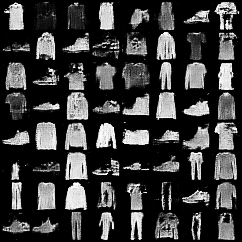
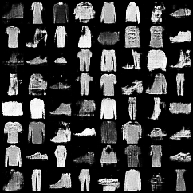
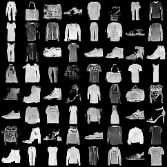
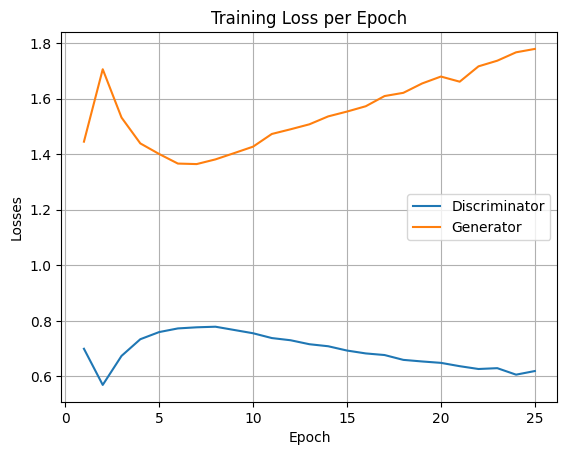
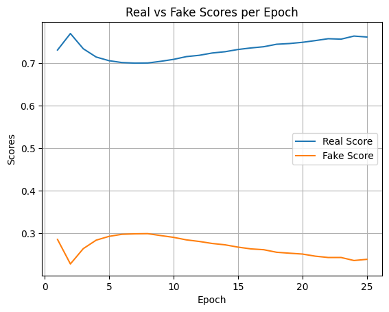

# Generating Fashion-MNIST Apparel using DCGANs

This repository implements a **Deep Convolutional Generative Adversarial Network (DCGAN)** to generate realistic apparel images based on the [Fashion-MNIST dataset](https://github.com/zalandoresearch/fashion-mnist). The project demonstrates adversarial training using PyTorch, where a **Generator** learns to synthesize apparel images while a **Discriminator** learns to distinguish real images from generated ones.

---

## Repository Structure
```
├── data/                     # Fashion-MNIST dataset (downloaded automatically)
├── generated/                # Saved generated images during training
├── Fashion_MNIST.ipynb       # Jupyter notebook with full implementation
├── G.pth                     # Trained Generator model weights
├── D.pth                     # Trained Discriminator model weights
```

---

## Model Architectures

### Generator
- Input: 100-dim latent vector (`z`)
- Upsampled using `ConvTranspose2d` layers
- Activation: ReLU for hidden layers, Tanh for output
- Output: 28×28 grayscale image

### Discriminator
- Input: 28×28 grayscale image
- Downsampled using `Conv2d` layers with LeakyReLU
- Output: Single probability score (real vs fake)

---

## Training Pipeline
1. **Discriminator Training**
   - Real images → label as 1
   - Generated images → label as 0
   - Compute Binary Cross-Entropy (BCE) loss

2. **Generator Training**
   - Generate fake images from latent vectors
   - Discriminator classifies them as real (label 1)
   - Backpropagate BCE loss to update Generator

3. **Training Loop**
   - Alternate between training discriminator and generator
   - Save generated image grids after each epoch

---

## Results
Sample outputs of the generator across training epochs:

| Epoch 1 | Epoch 5 | Epoch 10 | Epoch 20 |
|---------|---------|----------|----------|
|  |  |  |  |

---

### Loss Curves
Training progression of **Generator vs Discriminator losses**:



### Real vs Fake Scores
Evolution of discriminator’s ability to distinguish between real and generated images:



---

## Requirements
- Python 3.8+
- PyTorch
- torchvision
- matplotlib
- tqdm
- numpy

Install requirements with:
```bash
pip install torch torchvision matplotlib tqdm numpy
```

---

## Usage
1. Clone this repository:
```bash
git clone https://github.com/Aman-Sunesh/Generating-Fashion-MNIST-Apparel-using-DCGANs-.git
cd Generating-Fashion-MNIST-Apparel-using-DCGANs-
```

2. Run the notebook:
```bash
jupyter notebook Fashion_MNIST.ipynb
```

3. Trained weights are saved as `G.pth` (Generator) and `D.pth`.

---

## License
This project is for **academic and research purposes only**.

---

Author: [Aman Sunesh](https://github.com/Aman-Sunesh)
